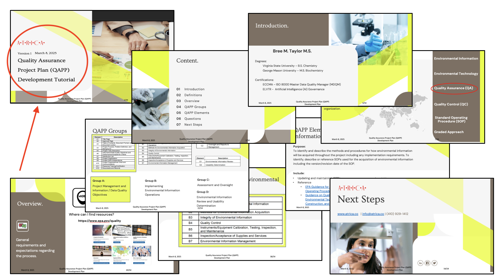
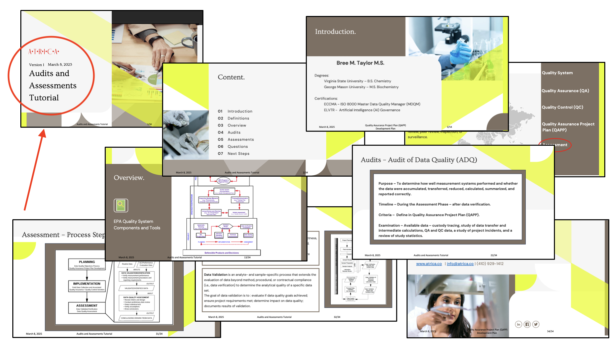

# 💧 Maryland Water Quality

This project analyzes water quality data collected from monitoring stations across Maryland, sourced from the National Water Quality Monitoring Council. The project applies data science, data engineering, and chemistry expertise to identify trends, assess data quality, and ensure regulatory compliance.

In addition to data analysis, I have developed two in-depth tutorials on Quality Assurance Project Plan (QAPP) development and Audits & Assessments, aligning with EPA guidelines for environmental data quality management.

#### ✔ Project Objectives:

- Perform Data Cleaning & Preprocessing to ensure data accuracy and consistency.
- Identify Seasonal Patterns & Anomalies in key water quality indicators.
- Develop Quality Assurance Standards aligned with EPA QAPP guidelines.
- Create Interactive Dashboards in Tableau for data-driven decision-making.
- Provide Actionable Insights for environmental monitoring and policy planning.

#### 🧑🏾‍🏫 Presentation Preview:  

    

        
    

    

         
    

This project highlights expertise in environmental data analysis, statistical modeling, data visualization, regulatory compliance, and data quality assurance, enhanced by educational resources that guide professionals in implementing data governance best practices.

### Project Description
This project explores water quality data from Maryland’s monitoring stations, analyzing trends, patterns, and anomalies in key water indicators. The dataset includes temperature, pH, dissolved oxygen, salinity, and optical density, spanning 10+ years, with a noticeable decline in data availability in recent years.

The primary goal is to analyze and visualize the data with a strong focus on data quality, integrity, and insightful reporting. Using exploratory data analysis (EDA) and interactive visualizations in Tableau, this project aims to uncover key environmental trends and support data-driven decision-making.

#### 🚀 Future Enhancements:
- Implement a fully automated ETL (Extract, Transform, Load) pipeline to streamline data ingestion, transformation, and loading into the database.
- Develop automated validation scripts to ensure data accuracy, consistency, and reliability before loading into the database.
- Expand the dataset to include more recent and comprehensive monitoring records.
- Enhance regulatory compliance tracking using Environmental Protection Agency (EPA) standards.

### Data Source
National Water Quality Monitoring Council - [Water Quality Portal](https://www.waterqualitydata.us/) 

### Dashboard
Interact with Tableau dashboard [here](https://public.tableau.com/app/profile/bree.taylor2920/viz/MDWaterQuality/Dashboard1?publish=yes). This dashboard enables users to dynamically filter by indicator and analyze trends to support environmental decision-making. 

### Insights
 Water quality was evaluated based on the following key metrics:

Salinity – Measures the concentration of dissolved salts in water, influencing aquatic life and determining water suitability for drinking, irrigation, and ecosystem health. Excessive salinity can be toxic to freshwater organisms and impact water usability.

Dissolved Oxygen (DO) – Represents the amount of oxygen available in water, essential for aquatic life. Low DO levels (below 5 mg/L) can stress fish, while levels below 3 mg/L are often too low to support aquatic organisms, below 1 mg/L is considered hypoxic and usually devoid of life.

pH – Indicates the acidity or alkalinity of water, affecting chemical and biological processes. Most aquatic organisms thrive in a pH range of 6.5 to 9, while extreme pH levels can limit species distribution and impact ecosystem balance.

Optical Density (Turbidity) – Reflects water clarity by measuring suspended particles. High turbidity can reduce light penetration, affect aquatic ecosystems, and alter water chemistry, but should be evaluated alongside other water quality indicators.

Water Temperature – Affects metabolic rates, growth, and survival of aquatic organisms. Extreme temperature fluctuations can cause stress, disrupt species life cycles, and influence water chemistry, impacting overall ecosystem health.

🧂 Salinity:
- Decrease in observations from 2020 to 2023, potentially affecting averages.
- Fewer observations recorded during colder months (November–March).
- Salinity levels tend to be higher in the fall and winter months.

🫧 Dissolved Oxygen (DO):
- Decrease in observations from 2020 to 2023, potentially affecting averages.
- Fewer observations recorded during colder months (November–March).
- Downward trend in DO levels from February to September.
- May 2023's monthly average deviates from the trends observed between 2014 and 2022.
- All testing sites with stressful dissolved oxygen levels have fewer than 50 observations, which may impact averages—except for Centennial Lake, which should be further investigated.

🧪 pH:
- Decrease in observations from 2020 to 2023, potentially affecting averages.
- Fewer observations recorded during colder months (November–March).
- Most testing sites report a normal pH, while several show low average pH; no sites report high average pH.
- All testing sites with low average pH have fewer than 20 observations, which may affect averages.

🔬 Optical Density (Turbidity):
- Significant decrease in observations in 2017 and from 2021 to 2023, potentially affecting averages.
- The drastic drop in observations in 2017 does not align with other water quality trends in the dataset and should be further investigated.
- Minimal variance observed in turbidity levels.

🌡️ Water Temperature:
- Decrease in observations from 2020 to 2023, potentially affecting averages.
- Fewer observations recorded during colder months (November–March).
- Water temperature displays a clear seasonal pattern, with higher temperatures in summer and lower temperatures in winter.

### Recommendations
📉 Improve Data Collection Consistency:
- Investigate reasons for declining observations (e.g., funding cuts, site closures, fewer sampling events) and establish a plan to ensure consistent data collection.
- Ensure winter sampling is conducted at a sufficient frequency to accurately track seasonal water quality variations.
- Review the methodology, instrument calibration records, or missing data reports from that year to determine if the decrease is due to procedural changes or data loss.
🎯 Enhance Data Quality and Accuracy:
- Increase sampling frequency at these locations to improve statistical reliability.
- Assess potential causes of DO depletion, such as pollution, algal blooms, or water stagnation, and consider targeted environmental interventions.
🧑🏾‍💻 Refine Data Analysis and Reporting:
- Cross-reference water quality trends with precipitation records, land development changes, and industrial activity to better understand long-term patterns.
- Apply weighted averages or normalize data based on sample counts to avoid overrepresenting sites with limited data.

### How to Run the Project
1. [Load Raw Data (optional)](scripts/load_raw_data.py)
2. [Extract](scripts/extract_md_water_quality_data.R)
3. [Exploratory Data Analysis (EDA)](notebooks/exploratory_data_analysis.ipynb)
4. [Transform](scripts/transform_raw_data.py)
5. [Load](scripts/load_transformed_data.py)
6. [Export to Tableau](scripts/export_for_tableau.py)
7. [Analyze / Visualize](tableau/md_water_quality.twbx) 

### Tools
|Category|Tool Used|
|--------|---------|
|Data Storage|PostgreSQL, CSV|
|Data Processing|Python, Pandas, NumPy, SQL, SQLAlchemy|
|Exploratory Analysis|Jupyter Notebook|
|Data Quality|Pandas, SQL queries|
|Data Visualization|Tableau, Seaborn, Matplotlib|
|Automation|Python Scripts|
|Project Management|GitHub, Markdown (README.md)|

### Contact

Connect with me on [LinkedIn](https://www.linkedin.com/in/bree-taylor-927bb22a?lipi=urn%3Ali%3Apage%3Ad_flagship3_profile_view_base_contact_details%3BTXByo%2FGqS0Sogeu1fjQReQ%3D%3D)    |    Check out my company website: [A•T•R•I•C•A•](https://www.atrica.co/)

